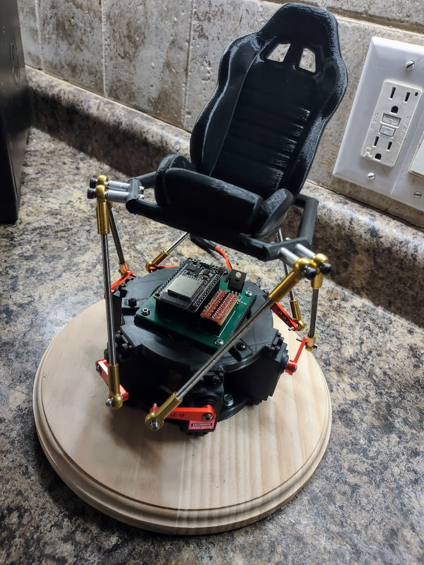

# Mini-6DOF
Desktop size version of my Open 6DOF Platform. This is an expansion on my initial learning that I did to get up to speed for the big version. 

This project uses an ESP32 as the main control, using serial-> USB communications as well as BLE to command the platform to move.

This mini 6DOF project is a fork of the code used for my Full Scale Open 6DOF project found here.
[https://github.com/knaufinator/6DOF-Rotary-Stewart-Motion-Simulator](https://github.com/knaufinator/6DOF-Rotary-Stewart-Motion-Simulator)

# Simtools interface setup
Config for PC to ESP32 USB-> Serial connection within simtools, simtools will be configured to send the 6 axis parameters over to the ESP32 every 1 ms. Over a 115200 baud connection. The packet consists of 6 - 12 bit values, delimited by comma and ended by a "X" Character to signal the ESP32 that the packet is done.

For simtools you encode the axis representations of x,y,z,Ry,Rx,RZ with the configuration
"Interface - Output" = <Axis1a>,<Axis2a>,<Axis3a>,<Axis4a>,<Axis5a>,<Axis6a>X

With these settings the software package Simtools or any other custom application may communicate and command the simulator platform to move.

  
# BLE interface setup
  --TODO--
  
  
  
  
  
